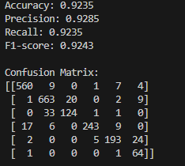
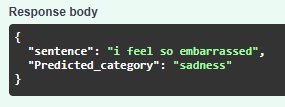

# 情緒分類模型訓練與應用

## 目標
- 使用 Huggingface SetFit/emotion 資料集訓練能辨識多種情緒類別的文本分類模型
- 提供 CLI、API 或 Web App 介面，輸入英文句子並輸出情緒類別

## 環境需求
- Python 3.10
- 建議創建虛擬環境並安裝依賴：  
  ```
  pip install -r requirements.txt
  ```

> **注意：** 因不同 CUDA 版本對應不同的 PyTorch，請先執行 `nvidia-smi` 查詢 CUDA 版本，再選擇相容的 torch 版本。  
> 可透過 `test_torchGPU.py` 確認 GPU 是否可用，並列出 GPU 型號。  
> 本專案的部分大型模型儲存在 Git LFS 上，若因 GitHub LFS 下載流量限制導致模型無法下載，歡迎私訊聯絡我取得 Google Drive 下載連結。

## 訓練與驗證
本專案以 `roberta-base` 模型為基礎進行微調，並使用測試集計算正確率、精確度及混淆矩陣。

1. 檔案說明  
   - `test_torchGPU.py`：檢查 PyTorch 是否能正常調用 GPU  
   - `train_model.py`：模型訓練程式  
   - `test_model.py`：使用測試集評估模型指標  

2. 流程  
   - 根據驗證集正確率選取最佳 checkpoint  
   - 最佳模型選擇驗證正確率相對高且發現後續有 overfitting 現象，保存至 `results/checkpoint_results`  

3. 結果  
   - 測試集正確率約 92.35%  
     

## API
本專案使用 FastAPI 提供服務，相關依賴已列於 `requirements.txt`，無需另行安裝。運行方式：

```
python main.py
```

- 開啟瀏覽器並訪問 `http://localhost:8080/docs`，使用互動式 API 文件進行測試  
- 回傳 JSON 格式，方便前端或行動應用程式呼叫  
  

## 專案結構

    root_folder/ 
    ├── emotion/
    │   ├── train.jsonl
    │   ├── validation.jsonl
    │   └── test.jsonl
    ├── results/
    │   └── checkpoint_results/
    │       ├── config.json
    │       ├── model.safetensors
    │       ├── optimizer.pt
    │       ├── rng_state.pth
    │       ├── scheduler.pt
    │       └── trainer_state.json
    ├── .gitignore
    ├── main.py
    ├── train_model.py
    ├── test_model.py
    ├── test_torchGPU.py
    ├── log.py
    └── README.md
